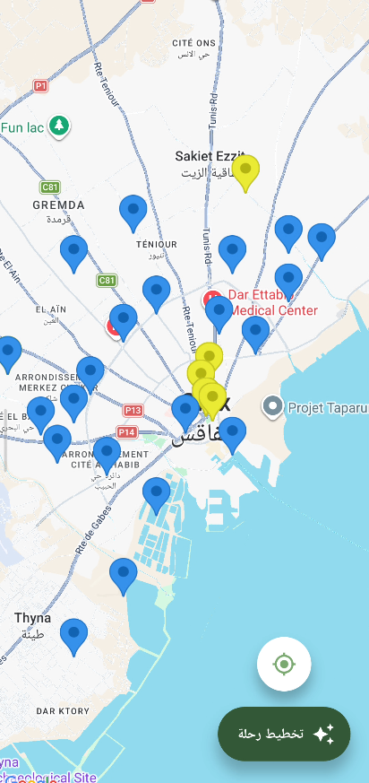
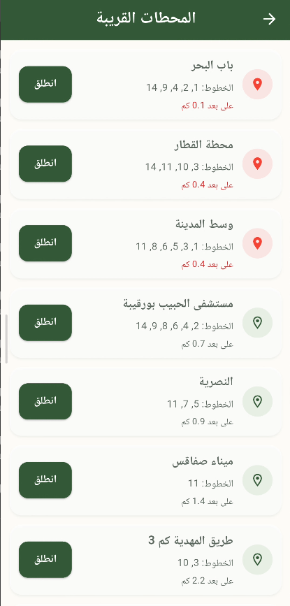
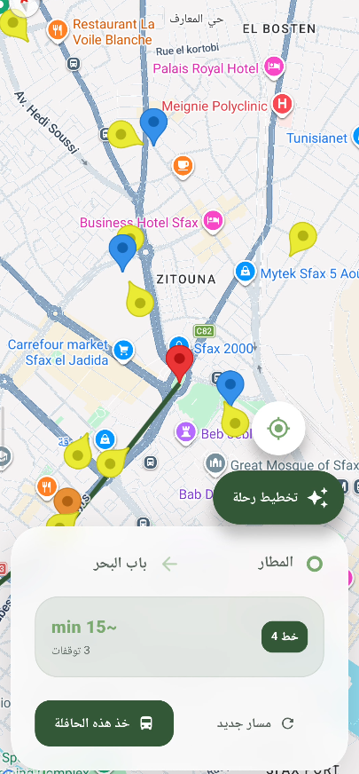
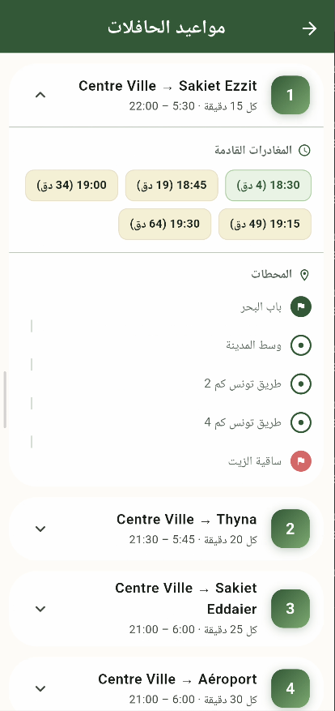

# 🚌 Basira - Your AI companion for accessible travel in Sfax


**Basira** is a mobility-as-a-service platform for citizens with disabilities in Sfax, Tunisia. It optimizes the SORETRAS bus network through a transit pipeline, voice-first assistive design, and AI-powered route planning.

---
## About
Basira is an inclusive bus companion application designed specifically for the SORETRAS public transport network in Sfax, Tunisia. Built with accessibility at its core, Basira empowers all commuters—including the visually impaired—to navigate the city's bus system with independence and ease. By combining real-time navigation, an intelligent AI assistant, and an intuitive voice-driven interface, Basira ensures that public transport is accessible to everyone.

## Features
- **Real-Time Map Navigation:** Track routes, locate stations, and navigate your journey using interactive maps powered by Google Maps and Flutter Map.
- **Voice Input & Output:** Fully integrated Text-to-Speech (TTS) and Speech-to-Text (STT) functionality provides a continuous, hands-free interaction for visually impaired users.
- **AI Assistant:** Powered by Google Generative AI (Gemini) to answer queries, guide the navigational experience, and provide intelligent transit support.
- **Smart Notifications:** Receive timely location-based alerts and trip updates via robust local notifications.
- **Multi-Language Support:** Comprehensive internationalization (i18n) ensuring the app is accessible in multiple languages.
- **Haptic Feedback:** Tactile responses designed to guide users intuitively without relying exclusively on visual cues.
- **Offline Data Integration:** Reliable access to critical transit schedules and routes via robust offline CSV data parsing.

## Screenshots
<div align="center">
  
  &nbsp;&nbsp;&nbsp;
  
  &nbsp;&nbsp;&nbsp;
  
</div>

<div align="center">
  
  &nbsp;&nbsp;&nbsp;
  
  &nbsp;&nbsp;&nbsp;
  
</div>

## Getting Started

### Prerequisites
- [Flutter SDK](https://docs.flutter.dev/get-started/install) `^3.11.4`
- Active Android development setup (Android Studio & SDK configured)
- An Android device or emulator for testing

### 📦 Dependencies
Basira relies on the following key packages:
- `flutter_riverpod` / `riverpod` — state management
- `flutter_tts`, `speech_to_text` — voice assistance
- `dio` — HTTP / API client
- `csv` — CSV parsing
- `google_maps_flutter`, `flutter_map`, `latlong2` — map and geospatial support
- `shared_preferences` — persisted user settings
- `flutter_dotenv` — environment configuration

---

### Installation

1. **Clone the repository:**
   ```bash
   git clone https://github.com/yourusername/basira.git
   cd basira
   ```

2. **Configure Environment Variables:**
   Create a `.env` file in the root directory (see the [Environment Variables](#environment-variables) section below for required keys).

3. **Install Dependencies:**
   ```bash
   flutter pub get
   ```

4. **Run the Application:**
   ```bash
   flutter run
   ```

## Project Structure
```text
basira/
├── android/       # Android-specific configuration and build files
├── assets/        # App assets including images, fonts, and offline CSV data
├── lib/           # Main Dart source code
│   ├── data/      # Repositories, API connections, and data providers
│   ├── features/  # Domain-driven feature modules containing UI and logic
│   ├── l10n/      # Localization dictionaries and ARB files
│   └── main.dart  # Application entry point
└── test/          # Unit and widget tests
```

## Environment Variables
Basira requires environment variables to securely integrate sensitive external API keys. Create a `.env` file at the root of the project with the following parameters:

```env
# Google Maps API Key for spatial mapping and location services
MAPS_API_KEY=your_google_maps_api_key_here

# Google Generative AI (Gemini) API Key for the intelligent assistant
GEMINI_API_KEY=your_gemini_api_key_here
```

## 🔮 Future Roadmap
Recommended improvements for production-grade deployment:
- replace CSV injection with live GTFS or REST transit feeds,
- add robust unit and widget tests for providers and repository logic,
- secure external API keys and remove hard-coded placeholders,
- add fallback behavior for TTS/STT failures,
- integrate real occupancy/crowd sensing and transport alerts.

---

## ✅ Summary
Basira is a strong accessibility-first Flutter application that cleanly separates UI, state, and data layers. The current implementation uses a synthetic CSV data injection engine but is architected for a future hot-swap to live GTFS/REST transit sources, while delivering voice-first and haptic-first experiences for users with disabilities.
